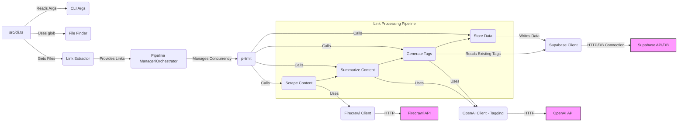

# System Patterns: Debateclub Markdown Link Scraper

## System Architecture

The application is architected as a **Command-Line Interface (CLI)** tool built with Node.js and TypeScript. It follows a **pipeline processing model** for handling links found in markdown files.

The core flow involves several distinct stages orchestrated by the main CLI script (`src/cli.ts`):

1.  **Input:** Reads markdown files from a specified source directory (`glob` likely used).
2.  **Extraction:** Parses files to extract `http/https` URLs (using markdown libraries like `remark`, `unist-util-visit`).
3.  **Enrichment (External Services):** For each unique URL:
    - **Scraping:** Calls the Firecrawl API (`@mendable/firecrawl-js`) to fetch web page content and metadata.
    - **AI Processing:** Calls the OpenAI API (`openai`) for:
        - Content summarization.
        - Tag generation (involves checking existing tags in the database first).
4.  **Persistence:** Stores the extracted link, scraped data, metadata, summary, and tags into a Supabase PostgreSQL database (`@supabase/supabase-js`).
5.  **Output:** Primarily database storage. CLI output likely indicates progress or errors.

**External Dependencies:** The system heavily relies on external services:
- Supabase (Database)
- Firecrawl (Web Scraping)
- OpenAI (AI Summaries & Tagging)

## Key Technical Decisions & Patterns

- **Technology Choices:** Node.js/TypeScript as the core platform. Supabase for managed Postgres. Firecrawl for robust scraping. OpenAI for AI capabilities.
- **Configuration:** Environment variables managed via `.envrc` and `direnv`. This separates configuration (API keys, URLs) from code.
- **Concurrency Management:** Explicit use of `p-limit` to control the number of concurrent network requests (to Firecrawl, OpenAI, potentially Supabase), preventing rate-limiting issues and managing resource usage.
- **Modularity (Inferred):** Although not explicit in the README, the distinct processing stages suggest potential modularity (e.g., separate modules/functions for extraction, crawling, summarizing, tagging, database interaction).
- **Asynchronous Operations:** Extensive use of async/await due to I/O operations (file reading, network requests).
- **CLI Framework (Inferred):** Use of a CLI argument parsing library (`yargs`, `commander`, etc.) is implied by the command-line flags mentioned in the README.
- **Build Process:** `esbuild` is used for efficient TypeScript compilation/bundling (`npm run build`).
- **Type Safety:** TypeScript provides static typing. Supabase type generation (`supabase gen types`) enhances database interaction safety.

## Component Relationships (High-Level)

## Critical Implementation Paths

- **Main Pipeline Execution:** The sequence of finding files, extracting links, and processing each link through scraping, summarization, tagging, and storage. Error handling and resilience within this path are crucial.
- **Configuration Loading:** Correctly loading API keys and service URLs from environment variables via `direnv`.
- **Database Interaction:** Successfully connecting to Supabase, querying existing tags, and inserting new link data and associations.
- **Concurrency Handling:** Ensuring `p-limit` is correctly applied to API calls to avoid errors and manage load.
